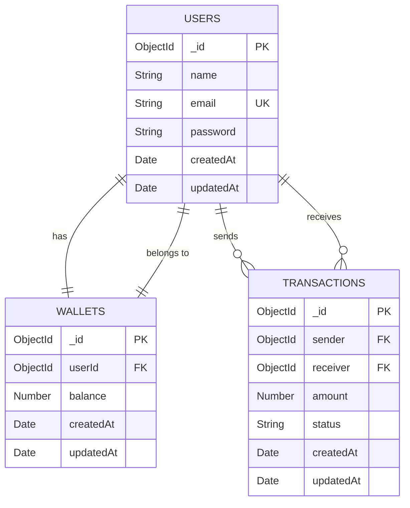
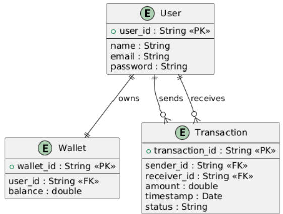

# QuickPayX – ER Diagram

## Mermaid Diagram

```mermaid
erDiagram
    USERS {
        ObjectId _id PK
        String name
        String email UK
        String password
        Date createdAt
        Date updatedAt
    }
    
    WALLETS {
        ObjectId _id PK
        ObjectId userId FK
        Number balance
        Date createdAt
        Date updatedAt
    }
    
    TRANSACTIONS {
        ObjectId _id PK
        ObjectId sender FK
        ObjectId receiver FK
        Number amount
        String status
        Date createdAt
        Date updatedAt
    }
    
    USERS ||--|| WALLETS : "has"
    USERS ||--o{ TRANSACTIONS : "sends"
    USERS ||--o{ TRANSACTIONS : "receives"
    WALLETS ||--|| USERS : "belongs to"
```

## Image Reference

