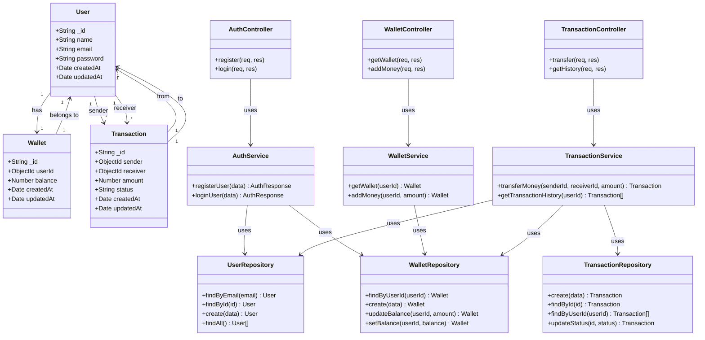
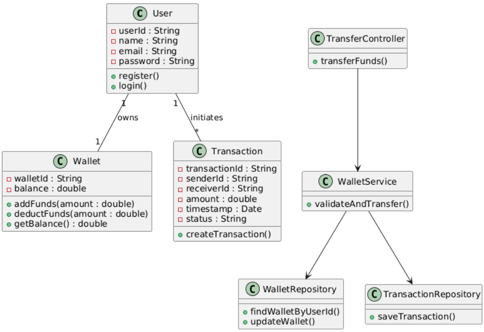

# QuickPayX – Class Diagram

## Mermaid Diagram

```mermaid
classDiagram
    class User {
        +String _id
        +String name
        +String email
        +String password
        +Date createdAt
        +Date updatedAt
    }
    
    class Wallet {
        +String _id
        +ObjectId userId
        +Number balance
        +Date createdAt
        +Date updatedAt
    }
    
    class Transaction {
        +String _id
        +ObjectId sender
        +ObjectId receiver
        +Number amount
        +String status
        +Date createdAt
        +Date updatedAt
    }
    
    class UserRepository {
        +findByEmail(email) User
        +findById(id) User
        +create(data) User
        +findAll() User[]
    }
    
    class WalletRepository {
        +findByUserId(userId) Wallet
        +create(data) Wallet
        +updateBalance(userId, amount) Wallet
        +setBalance(userId, balance) Wallet
    }
    
    class TransactionRepository {
        +create(data) Transaction
        +findById(id) Transaction
        +findByUserId(userId) Transaction[]
        +updateStatus(id, status) Transaction
    }
    
    class AuthService {
        +registerUser(data) AuthResponse
        +loginUser(data) AuthResponse
    }
    
    class WalletService {
        +getWallet(userId) Wallet
        +addMoney(userId, amount) Wallet
    }
    
    class TransactionService {
        +transferMoney(senderId, receiverId, amount) Transaction
        +getTransactionHistory(userId) Transaction[]
    }
    
    class AuthController {
        +register(req, res)
        +login(req, res)
    }
    
    class WalletController {
        +getWallet(req, res)
        +addMoney(req, res)
    }
    
    class TransactionController {
        +transfer(req, res)
        +getHistory(req, res)
    }
    
    User "1" --> "1" Wallet : has
    User "1" --> "*" Transaction : sender
    User "1" --> "*" Transaction : receiver
    Wallet "1" --> "1" User : belongs to
    Transaction "1" --> "1" User : from
    Transaction "1" --> "1" User : to
    
    AuthService --> UserRepository : uses
    AuthService --> WalletRepository : uses
    WalletService --> WalletRepository : uses
    TransactionService --> WalletRepository : uses
    TransactionService --> TransactionRepository : uses
    TransactionService --> UserRepository : uses
    
    AuthController --> AuthService : uses
    WalletController --> WalletService : uses
    TransactionController --> TransactionService : uses
```

## Image Reference

