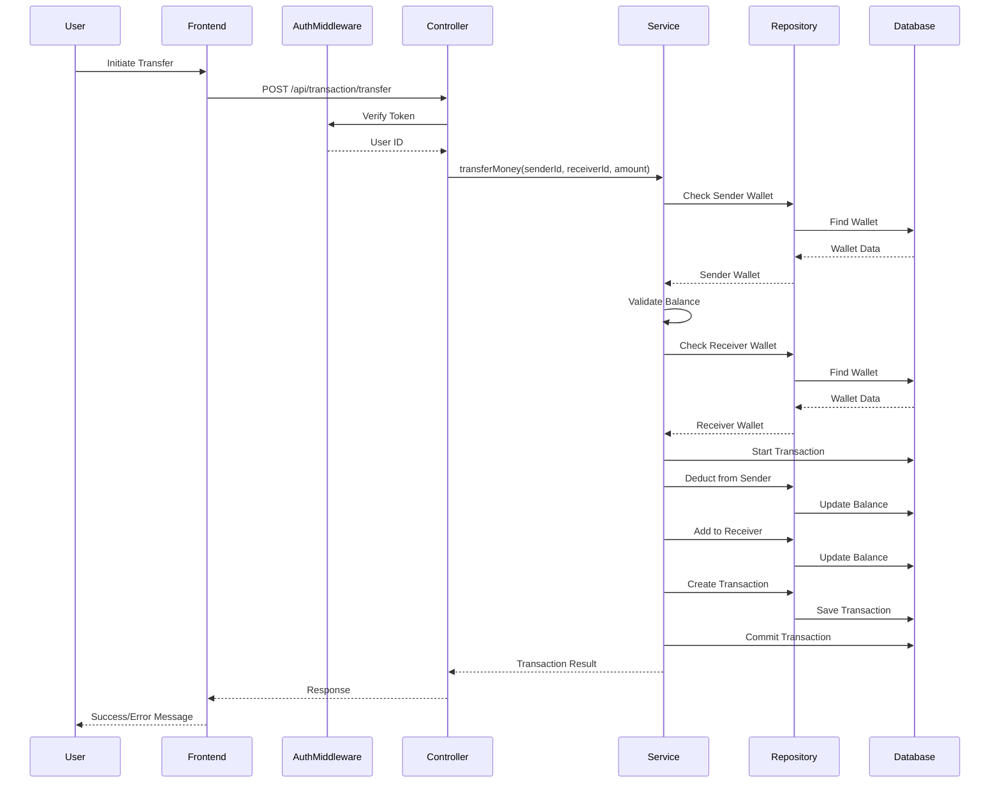
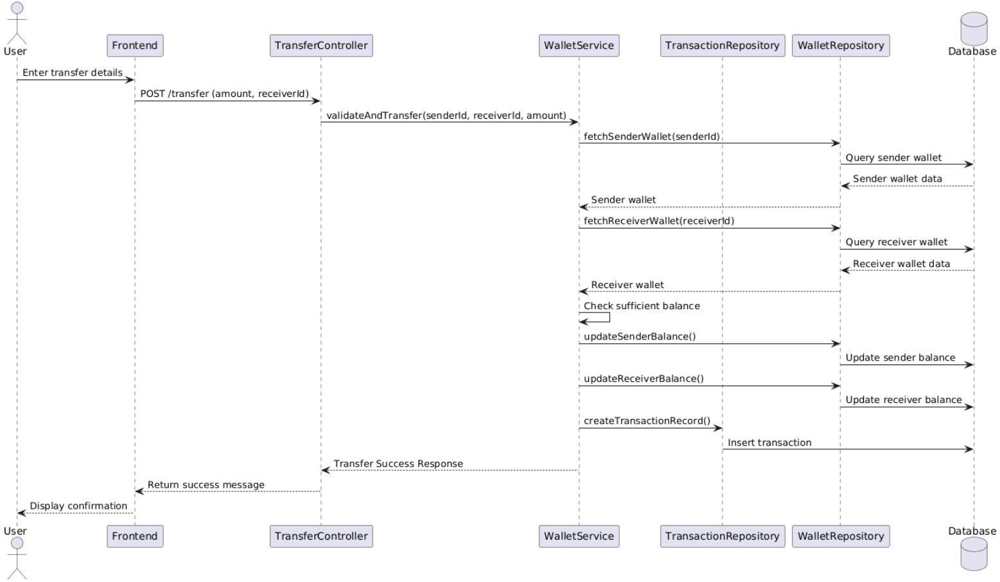

# QuickPayX – Sequence Diagram

## Mermaid Diagram (Fund Transfer Flow)

```mermaid
sequenceDiagram
    participant User
    participant Frontend
    participant AuthMiddleware
    participant Controller
    participant Service
    participant Repository
    participant Database

    User->>Frontend: Initiate Transfer
    Frontend->>Controller: POST /api/transaction/transfer
    Controller->>AuthMiddleware: Verify Token
    AuthMiddleware-->>Controller: User ID
    
    Controller->>Service: transferMoney(senderId, receiverId, amount)
    Service->>Repository: Check Sender Wallet
    Repository->>Database: Find Wallet
    Database-->>Repository: Wallet Data
    Repository-->>Service: Sender Wallet
    
    Service->>Service: Validate Balance
    
    Service->>Repository: Check Receiver Wallet
    Repository->>Database: Find Wallet
    Database-->>Repository: Wallet Data
    Repository-->>Service: Receiver Wallet
    
    Service->>Database: Start Transaction
    Service->>Repository: Deduct from Sender
    Repository->>Database: Update Balance
    Service->>Repository: Add to Receiver
    Repository->>Database: Update Balance
    Service->>Repository: Create Transaction
    Repository->>Database: Save Transaction
    Service->>Database: Commit Transaction
    
    Service-->>Controller: Transaction Result
    Controller-->>Frontend: Response
    Frontend-->>User: Success/Error Message
```

## Image Reference

