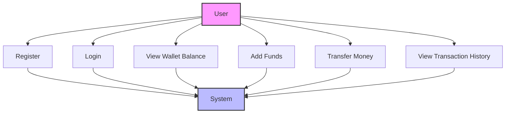
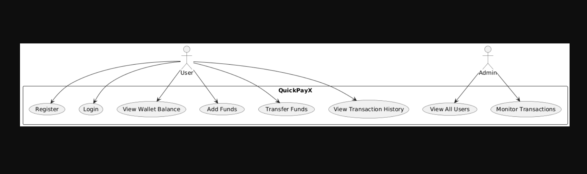

# QuickPayX – Use Case Diagram

## Mermaid Diagram

```mermaid
graph TD
    A[User] --> B[Register]
    A --> C[Login]
    A --> D[View Wallet Balance]
    A --> E[Add Funds]
    A --> F[Transfer Money]
    A --> G[View Transaction History]
    
    B --> H[System]
    C --> H
    D --> H
    E --> H
    F --> H
    G --> H
    
    style A fill:#f9f,stroke:#333,stroke-width:2px
    style H fill:#bbf,stroke:#333,stroke-width:2px
```

## Image Reference

